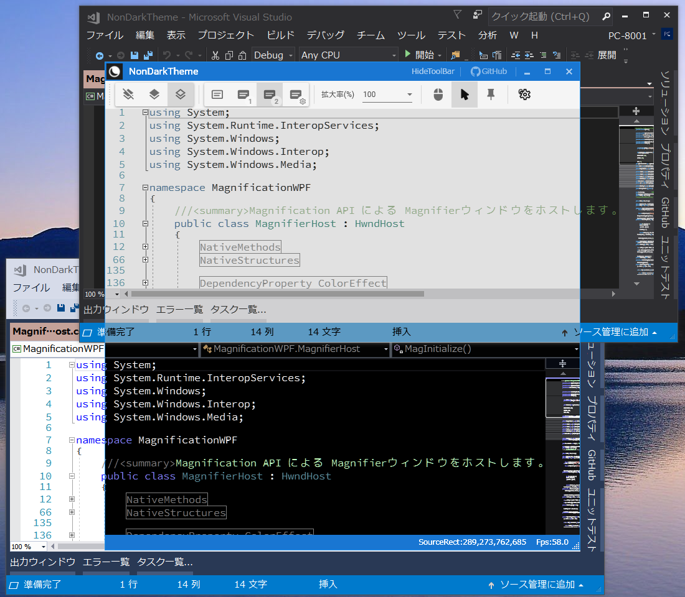

# NonDarkTheme

  

## 概要
拡大鏡APIを使用してウィンドウの背面を色の反転や拡大縮小します。  
常に最前面だけでなく、タイトルに特定文字を含むウィンドウのみに前面化することもできます。

## 特徴
* ネガポジ反転・白黒反転・ユーザー定義の3タイプの反転方法
* ウィンドウタイトルでの最前面制御機能
* 拡大縮小や移動での柔軟なビューポート設定
* Window組み込みタイプに使いやすいように、HwndHost派生実装ライブラリ

## ダウンロード
[最新バイナリ](/../../releases/download/v1.0.0/NonDarkTheme.zip)（Windows10でのみ動作確認）

## 使い方
**注意事項**に同意された方のみ使用してください。
1. ダウンロードしたNonDarkTheme.zipを展開し、適当なフォルダに入れます
2. NonDarkTheme.exeをダブルクリックします
3. Windows Defenderの注意喚起が出ますが、「詳細情報」を押すと「実行」ボタンが出ますので実行します（次回からは出なくなります）

[画像付きの詳しい説明へ](/../../wiki)

## ライセンス
[MIT](LICENSE)

## 注意事項
* ユーザーフォルダ（c:\ユーザー\\[ユーザー名]\AppData\Local\NonDarkTheme）
に設定を保存します  
使用を中止する場合はインストールしたフォルダとともに、上記NonDarkThemeフォルダも削除してください。
* Windows10以外での動作はわかりません（確認する手段がありませんので）
* 一切責任は持ちません

## 謝辞
見た目のカスタマイズに、下記を利用させて頂いております。  
[MahApps.Metro](https://mahapps.com/) Copyright (c) 2018 MahApps

見た目のカスタマイズと、アプリアイコン以外のアイコンはすべて、下記を利用させて頂いております。  
[Material Design In XAML Toolkit](http://materialdesigninxaml.net/) Copyright (c) 2015 James Willock,  Mulholland Software and Contributors

## 更新履歴
* 2018/12/16 ver1.0.0 初回リリース